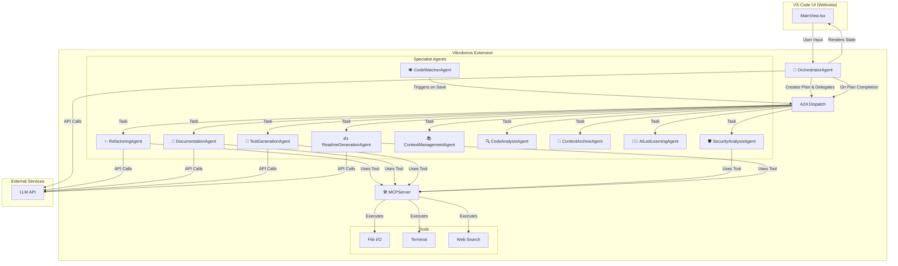

# ⚙️ Our Architecture

We designed Vibroboros with a multi-agent architecture to promote separation of concerns, making the system robust and extensible. This diagram illustrates the flow of control in our system.

## 🤖 Meet the Agents

The power of Vibroboros comes from its team of specialized agents. We've assembled this team so that each agent has a specific role, allowing the system to handle complex tasks with precision.

| Agent | Role | Key Responsibilities |
| :--- | :--- | :--- |
| 👑 **`OrchestratorAgent`** | **The Conductor** | Manages the entire workflow, creates plans, delegates tasks, and triggers README updates. |
| ✍️ **`ReadmeGenerationAgent`** | **The Documentarian** | Autonomously generates and updates the project's README.md file after major tasks are completed. |
| 📚 **`ContextManagementAgent`** | **The Librarian** | Gathers and prepares all necessary context (active file, codebase search results) for a given task. |
| 🔍 **`CodeAnalysisAgent`** | **The Cartographer** | Builds and maintains a symbol index of the entire workspace for fast and relevant code lookups. |
| ✨ **`RefactoringSuggestionAgent`**| **The Artisan** | Analyzes code and suggests improvements and refactorings based on best practices and user preferences. |
| 📝 **`DocumentationGenerationAgent`**| **The Scribe** | Generates documentation (e.g., JSDoc, Python docstrings) for specific functions, classes, and methods. |
| 🧪 **`TestGenerationAgent`** | **The Quality Engineer** | Writes unit tests for your code using the appropriate testing framework for the language. |
| 🛡️ **`SecurityAnalysisAgent`** | **The Guard** | Performs fast, local security scans for common vulnerabilities using regex-based patterns. |
| 🧠 **`AILedLearningAgent`** | **The Mentor** | Tracks user feedback on suggestions to create a preference model that personalizes the AI's behavior. |
| 💾 **`ContextArchiveAgent`** | **The Historian** | Provides the system with long-term memory by saving and retrieving key information across sessions. |
| 👁️ **`CodeWatcherAgent`** | **The Sentinel** | Runs in the background, watching for file changes to trigger proactive tasks like security scans and re-indexing. |
